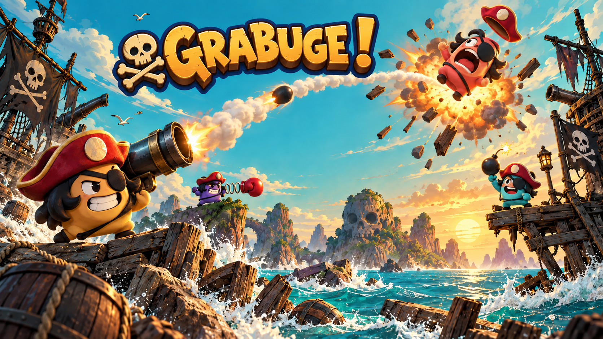
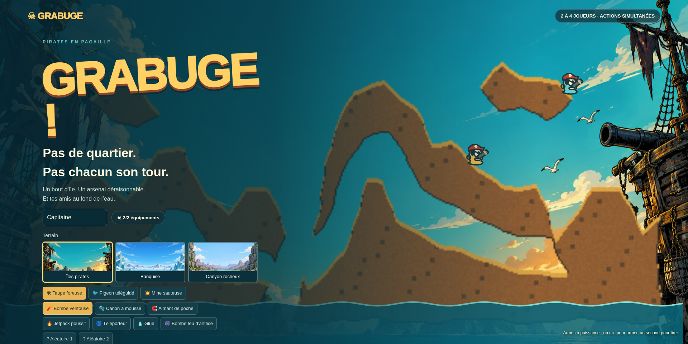
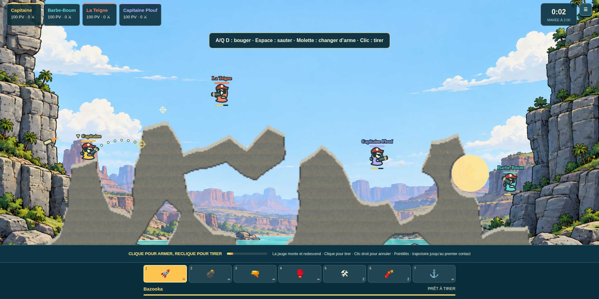

# GRABUGE !

**Pas de quartier, pas de tour par tour ! Ça tire de tous les côtés !**

Grabuge est un jeu d'artillerie 2D en temps réel pour 2 à 4 pirates. Tout le monde se déplace, vise et tire en même temps sur des terrains entièrement destructibles, pendant que la marée finit par engloutir les positions les plus basses.



## Sommaire

- [Le jeu](#le-jeu)
- [Modes de jeu](#modes-de-jeu)
- [Terrains et arsenal](#terrains-et-arsenal)
- [Comment jouer](#comment-jouer)
- [Lancer le projet localement](#lancer-le-projet-localement)
- [Déployer sur Cloudflare](#déployer-sur-cloudflare)
- [Architecture](#architecture)
- [Tests](#tests)
- [Sécurité et données](#sécurité-et-données)

## Le jeu

Une manche oppose quatre personnages, humains ou bots. Les tirs sont balistiques, les explosions creusent réellement le décor et chaque ouverture créée peut devenir un passage, un piège ou une ligne de tir. Après deux minutes, la marée monte et force les survivants à quitter les zones basses.

Le jeu propose notamment :

- des actions simultanées, sans système de tours ;
- un terrain bitmap destructible et synchronisé entre les joueurs ;
- 18 armes et équipements, des classiques aux gadgets volontairement absurdes ;
- quatre niveaux de bots : Facile, Normal, Difficile et Expert ;
- trois terrains avec des reliefs, textures et ambiances distincts ;
- des statistiques et distinctions de fin de partie ;
- une interface clavier, souris et tactile.



## Modes de jeu

### Contre les bots

Choisis ton pseudonyme, ton terrain, deux équipements de départ et le niveau des bots. Les trois places restantes sont contrôlées par l'ordinateur.

### Avec des amis

Crée un salon nommé ou rejoins un salon actif depuis la liste publique. Le capitaine choisit le terrain, le niveau des bots et lance la manche ; les places libres sont automatiquement complétées par des bots.

Un salon peut être protégé par mot de passe. Le lobby comprend aussi un chat éphémère : les messages ne sont pas persistés et un nouvel arrivant ne reçoit pas l'historique précédent.

### Entraînement

Le terrain d'entraînement donne accès à l'arsenal complet et fait réapparaître les personnages éliminés. Il permet d'essayer les trajectoires, la puissance et les gadgets sans enjeu de manche.

## Terrains et arsenal

Les trois cartes utilisent des silhouettes dessinées à la main, avec de petites variations déterministes. Elles comportent des arches, galeries, surplombs et plateformes suspendues qui peuvent être remodelés par les explosions.

- **Îles pirates** : arches de terre, îlots suspendus et grandes lignes de tir.
- **Banquise** : ponts de glace, cavernes ouvertes et positions aériennes fragiles.
- **Canyon rocheux** : aiguilles verticales, passages bas et ponts naturels.

Chaque joueur choisit deux équipements spéciaux. Une case `?` permet de tirer un équipement aléatoire au début de la manche, sans doublon. Les armes de base sont illimitées, les équipements ont un stock et certaines armes rares ne se trouvent que dans les caisses.

L'arsenal comprend entre autres bazooka, grenade, fusil à bouchons, gant à ressort, taupe foreuse, pigeon téléguidé, mine sauteuse, bombe ventouse, canon à mousse, aimant, grappin, jetpack, téléporteur, éclair, glue et bombe feu d'artifice.

## Comment jouer

| Action | Commande par défaut |
|---|---|
| Se déplacer | `A` ou `Q` / `D`, ou flèches gauche et droite |
| Sauter | `Espace` |
| Viser | Souris |
| Tirer | Clic gauche |
| Annuler une charge | Clic droit |
| Changer d'arme | Touches `1` à `9` ou molette |
| Régler le retard de grenade | `F` |
| Quitter ou couper un gadget actif | `E` |
| Vue d'ensemble | Maintenir `Tab` |
| Zoom | `Ctrl` + molette |
| Ouvrir les réglages | `Échap` |

Les armes à puissance se jouent en deux clics : un premier clic lance la jauge, un second déclenche le tir à la puissance affichée. Une trajectoire pointillée indique le parcours jusqu'au premier contact. Les autres armes partent dès le premier clic.

Sur mobile, les boutons de déplacement et de saut apparaissent au-dessus de l'inventaire. La visée et le tir utilisent les mêmes gestes en deux appuis que la souris.

Toutes les commandes clavier, le son et l'intensité des secousses sont configurables depuis les réglages.

## Lancer le projet localement

### Prérequis

- Node.js 22.13 ou plus récent ;
- npm.

Installe les dépendances :

```sh
npm ci
```

Lance le serveur multijoueur Cloudflare local :

```sh
npm run dev:game
```

Dans un second terminal, lance l'application :

```sh
npm run dev
```

Ouvre ensuite l'adresse affichée par le serveur web, généralement `http://localhost:3000`. Le client local utilise le serveur de salons sur `http://127.0.0.1:8788`.

Un serveur Node de secours est également disponible avec `npm run dev:fallback`. Il écoute sur le même port que l'émulateur Cloudflare, les deux ne doivent donc pas être lancés simultanément. Ce serveur de secours est réservé au développement local.

## Déployer sur Cloudflare

Le déploiement recommandé publie le frontend et le multijoueur dans un même Worker Cloudflare. Une seule URL est alors nécessaire pour jouer et partager un salon.

1. Installe les dépendances et connecte Wrangler à ton compte Cloudflare :

```sh
npm ci
npx wrangler login
npx wrangler whoami
```

2. Construis et déploie l'ensemble :

```sh
npm run deploy:cloudflare
```

Wrangler crée ou met à jour le Worker `grabuge-pirates`, configure les Durable Objects `GameRoom` et `RoomRegistry`, puis affiche l'URL publique `workers.dev`. Si ce nom de Worker est déjà utilisé sur ton compte, modifie la propriété `name` du mode `fullCloudflare` dans `vite.config.ts` avant le premier déploiement.

Pour prévisualiser exactement le paquet Cloudflare avant publication :

```sh
npm run build:cloudflare
npm run preview:cloudflare
```

L'aperçu est disponible sur `http://localhost:8790`. Un redéploiement peut interrompre les manches actives, il vaut mieux prévenir les joueurs avant une mise à jour. En cas de problème, l'historique des versions du Worker dans le tableau de bord Cloudflare permet de revenir à la version précédente.

## Architecture

Le client est une application React rendue avec Vinext. L'arène utilise Canvas 2D et une simulation déterministe à pas fixe de 30 Hz. En multijoueur, le serveur reste autoritaire : les clients envoient leurs commandes, jamais les dégâts ni les destructions.

| Fichier | Responsabilité |
|---|---|
| `app/game/engine.ts` | Physique, collisions, armes, bots, dégâts et statistiques |
| `app/game/terrain-layouts.ts` | Silhouettes destructibles des trois terrains |
| `app/game/render.ts` | Rendu Canvas, caméra, particules, textures et sons |
| `app/game/net-view.ts` | Prédiction locale, rejeu des entrées et lissage réseau |
| `app/game/Game.tsx` | Menus, partie, lobby, inventaire et réglages |
| `server/room.ts` | État autoritaire d'un salon et validation des commandes |
| `server/worker.ts` | API, WebSockets et Durable Objects Cloudflare |

Les événements de destruction sont ordonnés. Une connexion initiale ou une reconnexion reçoit le masque complet du terrain, puis uniquement les événements nécessaires. Le registre global liste les salons possédant encore des joueurs connectés et purge les entrées sans activité récente.

## Tests

La suite automatisée couvre le moteur, les armes, la destruction, les bots, les salons, la reconnexion, les statistiques et les trois terrains.

```sh
npm run typecheck
npm test
npm run build:cloudflare
```

Les scénarios WebSocket utilisent le Worker local lancé avec `npm run dev:game` :

```sh
npm run test:network
```

## Sécurité et données

Le jeu ne demande aucun compte utilisateur et n'intègre ni publicité ni outil de suivi. Les préférences restent dans le stockage local du navigateur. Les salons, conversations et parties sont éphémères ; seules les métadonnées nécessaires à la réouverture courte d'un salon sont conservées par son Durable Object.

Les mots de passe de salon sont salés et hachés côté serveur, mais ils constituent une protection conviviale et non un système d'authentification. En production, utilise uniquement l'URL HTTPS fournie par Cloudflare.

Aucun secret de déploiement ne doit être commité. Les fichiers `.env*`, `.wrangler/`, `dist/` et `.openai/` sont ignorés ; seul `.env.example` est versionné. Les jetons Cloudflare doivent rester dans Wrangler ou dans les secrets du système d'intégration continue.

Les fonds illustrés ont été créés spécialement pour Grabuge. Les personnages, effets et terrains jouables sont dessinés par le moteur Canvas ; aucun asset d'un autre jeu n'est inclus.
